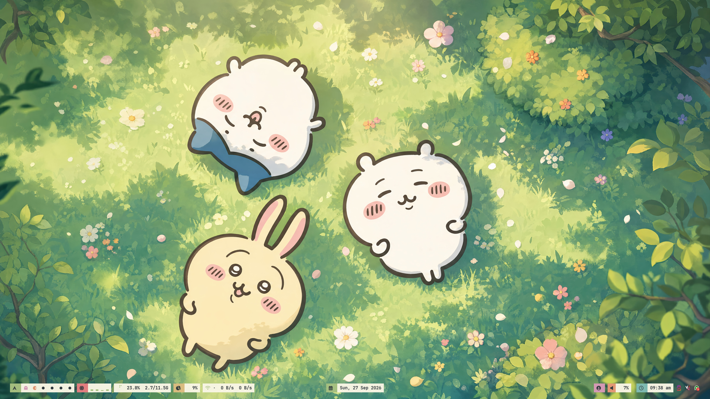
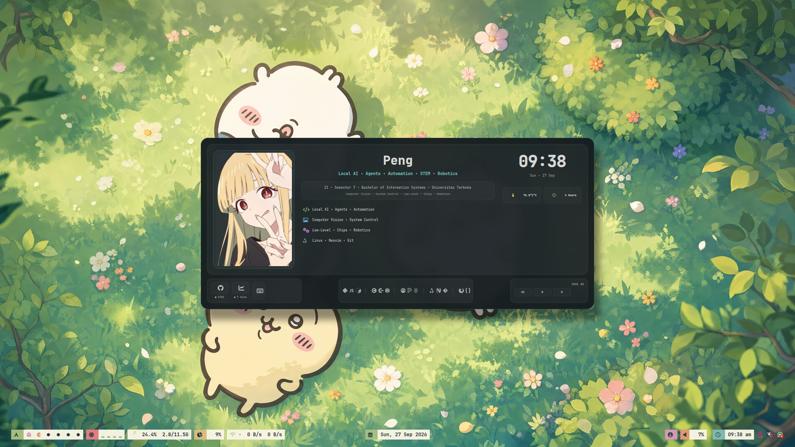
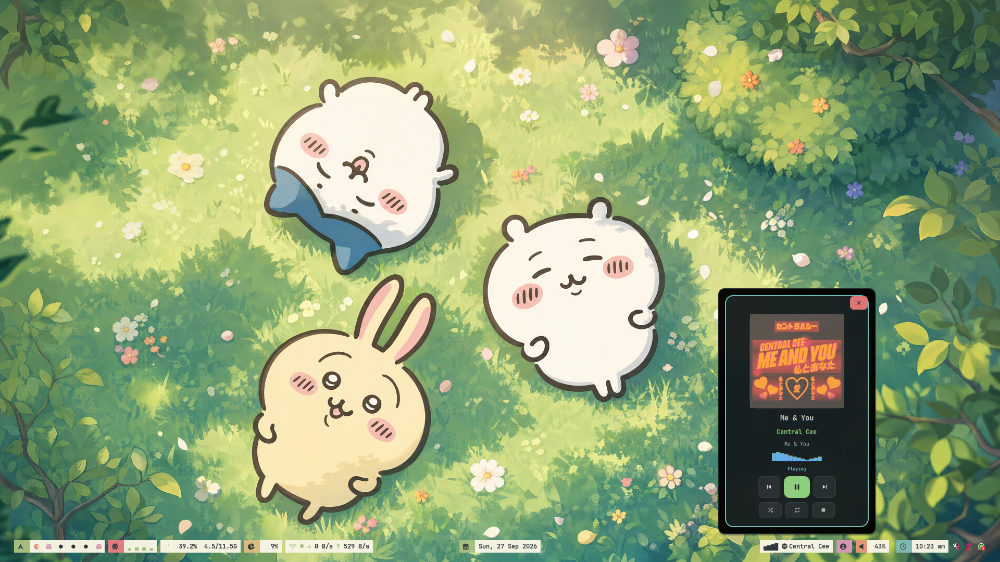

# 🌈 Dotrice: My Digital Yard 🐧

> **Wagwan!** 👋 Welcome to my personal Linux dotfiles. 
> Fully patterned around **bspwm**, **Neovim**, and **Kitty**.

No long ting here, fam. This is a bare simple, keyboard-driven Linux setup sorted for **grafting (coding), studying, and everyday vibes**. We don't do flashy for the sake of it—just a cold desktop that feels proper. 💻✨

---

## 📸 Peak Aesthetics (Previews)

Check the views, yeah? Looking absolutely peng.

### The Gaff (Desktop)


### Eww Widgets 


### Spotify Plyctl


---

## 🧩 The Mandem (Tech Stack)

Everything running on **Arch Linux**, obviously. 

```text
├── 🪟 bspwm     → Window manager (Keeps tings tidy)
├── ⌨️ sxhkd     → Keybindings (Moving mad quick)
├── 📝 Neovim    → Editor (Where the real grafting happens)
├── 🐱 Kitty     → Terminal (Bare fast)
├── 🚀 Rofi      → Launcher (Say less, just type)
├── 🔔 Dunst     → Notifications (Who's calling?)
├── ✨ Picom     → Compositor (Making it look elite)
├── 📖 Zathura   → Document reader (For the uni tings)
└── 🎨 GTK       → Theme & styling (Looking sharp, bruv)
